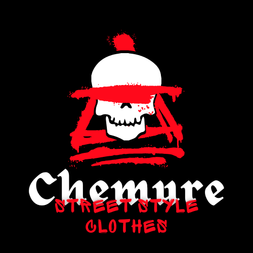
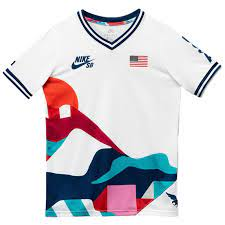

# site-html-cvl-street
INDEX HTML

<!DOCTYPE html>
<html lang="en">
<head>
    <meta charset="UTF-8">
    <meta http-equiv="X-UA-Compatible" content="IE=edge">
    <meta name="viewport" content="width=device-width, initial-scale=1.0">
    <title>Document</title>
    <link rel="stylesheet" href="style.css">
</head>
<body>
    <header class="cabecalho"> 
        
        <ul class="cabecalho-lista"> 
            <li class="cabecalho-lista-item">roupas masculinas</li>
            <li class="cabecalho-lista-item">roupas femininas</li>
        </ul>
        <section class=”escola”>
          <h2 class="escola titulo">Esclarecimento</h2>
          
 (Somos uma loja de roupa virtual mas sem objetivo de realmente fazer vendas, esse site é apenas um experimento da escola)

          
De uma olhada em meu site e avalie se foi bem feito

          
        </section>
    </header>

</body>
</html>

  
  

     
      
Nike

      
Adidas

      
Sumatra 

  
  

  
  STYLE CSS
  
  *{
    margin: 0;
    padding: 0;
}
.cabecalho {
    background-color: #000000;
    color: rgba(255, 255, 255, 0.815);
    display: flex;
    justify-content: space-evenly;
    align-items: center;
    padding: 10px 0;
}

.cabecalho-imagem{
   width: 20%;
   
}

.cabecalho-lista-item{
    display: space;
    margin: 0 16px;
    font-size: 24px;

}
.escola-imagem{
    width: 25%;
}
.escola{
    background-image: linear-gradient(#000000,#b40000 );
    color: aliceblue;
}
 
